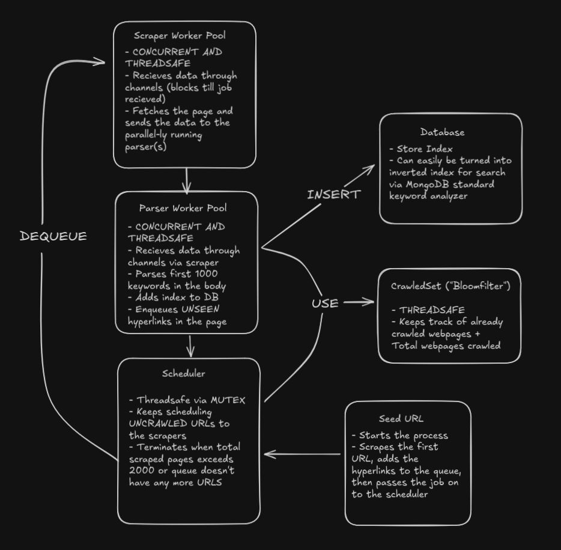

# LOKIX - A go based web crawler [WIP]
NOTE: _work in progress_

A project to learn more about web crawler internals. Topics to cover:
- What is a web-crawler? How does it work?
- Architecture of a monolithic web-crawler
- Embedding search capabilities using inverted-indexes
- Building the web-crawler from scratch -> the URL queue, the crawler, the HTML content parser, the index and inverted index maker? (idk yet) tests? (how? TvT)
- Tech Stack
- Design Decisions and Tradeoffs
- Pitfalls/Shortcomings of the Implementation + Future Scope

### Setup
- Docker -> `docker compose up --build` to rebuild the image if there are any changes, otherwise `docker compose up` will run the latest image

- Testing (via Docker) -> `docker compose -f compose.test.yml up --build` to run the tests in the container (NOTE, this is a separate stage and if I run the main compose file it will still compile even if tests fail)

NOTE TO SELF: If you want the build to fail if tests fail, you should run the tests within the build-stage before the binary is built, or ensure your CI pipeline specifically targets the run-test-stage first.

### Architecture
`lokix` will be split into 2 parts -> the webcrawler part, and then the "search engine" part.

#### Web Crawler
The web crawler will consist of 3 major parts -> the **crawler** that will visit the websites and get their content, the **parser** which will parse the content retrieved by the crawler, and extract key words and URLs, and finally, the **scheduler** which will be the one to give the crawler the new URLS. 

The scheduler will start with some seed URLS, and will feed the URL to the crawler. Then, the retrieved content will be parsed and the through the content, the inverted-index (for search) will be made and the URLs extracted will be passed back to the scheduler.

To prevent re-crawling of the same URLs, a **bloomfilter** will be used to check if a URL has already been visited or not. This way we check for previously crawled URLs in an efficient manner -> regarding both time and space.

Periodic re-crawling of websites to fetch updated content is currently out of scope for this project. I will also first make a single threaded application, and then move on to a concurrent application (the crawler and the parser) using a thread pool for resource sharing and channels for communication b/w the crawler and the parser.

Synchronizing the crawler and parser along with not trying to overflow the URL queue (I'll probably be using a normal queue for URL scheduling) will be an interesting challenge -> what will I do if the queue is full but the parser wants to insert X URLS? Will I wait and block till the queue is empty? That could lead to a deadlock (queue full, crawlers ready to pass the content to the parser, but parser is waiting for the queue to free up -> I'm working with limited threads here) Do I write the content to a DB and continue crawling? The parser can read the data w/o blocking the crawler. But read-write overhead is added, along with uneccessary storage of content. Also how do I decide what to read first? What if I restart the process, will the parser have a backlog (unparsed content in the DB from the previous iteration)? Do I JUST write the URLS in the DB? the scheduler can read from the DB and schedule -> marking them crawled/not-crawled to restart from the last un-crawled URL. Interesting design decisions to be made...

Headless browers needed as well? Or not for this iteration?

#### Search Engine
The search engine functionality is basically just an inverted index table for now. We'll start by creating an index with `URL` and the `keywords` found in that URL, and then create an inverted index of the form `keyword` - `URLs`. There won't be any crazy ranking algorithm to rank the results, probably just the most keyword matches.

I also want to limit the number of keywords analyzed per website to a limit as I don't want an insanely large collection -> building a search engine is not the primary purpose of this project. This will also help in leading to the different pages being parsed in about the same time, which might help performance...

I'll first implement a "static" search engine, where I first crawl how much I want to crawl and then search. But I also want to try dynamic updation of indices -> crawling continues in the bg and search engine also works.

