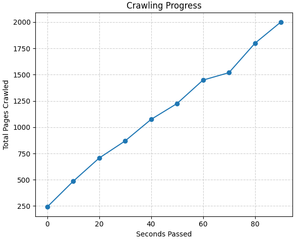
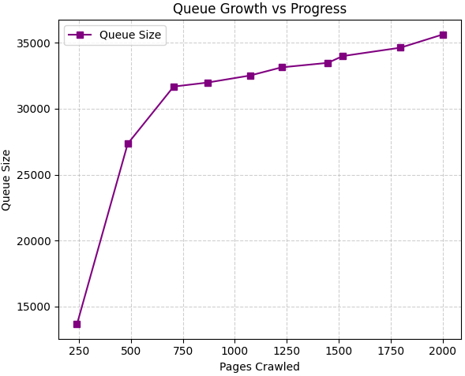
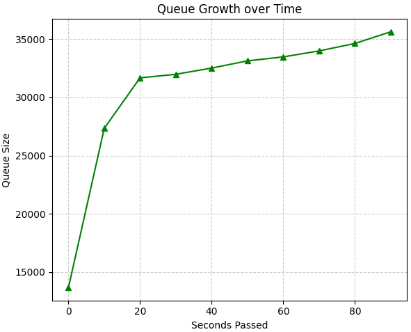

# LOKIX - A go based concurrent web-crawler 

A project to learn more about web crawler internals. Topics to cover:
- What is a web-crawler? How does it work?
- Architecture of a monolithic web-crawler
- Embedding search capabilities using inverted-indexes
- Building the web-crawler from scratch -> the URL queue, the crawler, the HTML content parser, the index and inverted index.
- Pros and Cons of the implementation

### Setup
Recommended - Docker
- Docker -> `make compose`
- Testing (via Docker) -> `make test` to run the tests in the container (NOTE, this is a separate stage and if I run the main compose file it will still compile even if tests fail)

NOTE TO SELF: If you want the build to fail if tests fail, you should run the tests within the build-stage before the binary is built, or ensure your CI pipeline specifically targets the run-test-stage first.

### Architecture

#### Web Crawler
The web crawler will consist of 3 major parts -> the **crawler** that will visit the websites and get their content, the **parser** which will parse the content retrieved by the crawler, and extract key words and URLs, and finally, the **scheduler** which will be the one to give the crawler the new URLS. 

The scheduler will start with some seed URLS, and will feed the URL to the crawler. Then, the retrieved content will be parsed and the through the content, the inverted-index (for search) will be made and the URLs extracted will be passed back to the scheduler.

To prevent re-crawling of the same URLs, a **bloomfilter** (in this case, a hashmap as implementing a full-fledged bloomfilter is timeconsuming - I've already implemented one [here](https://github.com/IAmRiteshKoushik/bluedis/pull/20)) will be used to check if a URL has already been visited or not. This way we check for previously crawled URLs in an efficient manner -> regarding both time and space.

Periodic re-crawling of websites to fetch updated content is currently out of scope for this project. I will also first make a single threaded application, and then move on to a concurrent application (the crawler and the parser) using a thread pool for resource sharing and channels for communication b/w the crawler and the parser.

Synchronizing the crawler and parser along with not trying to overflow the URL queue (I'll probably be using a normal queue for URL scheduling) will be an interesting challenge -> what will I do if the queue is full but the parser wants to insert X URLS? Will I wait and block till the queue is empty? That could lead to a deadlock (queue full, crawlers ready to pass the content to the parser, but parser is waiting for the queue to free up -> I'm working with limited threads here) Do I write the content to a DB and continue crawling? The parser can read the data w/o blocking the crawler. Do I JUST write the URLS in the DB? the scheduler can read from the DB and schedule -> marking them crawled/not-crawled to restart from the last un-crawled URL. Interesting design decisions to be made...

I decided to go for the not-so elegant - if the queue is full, drop additional URLS. The best way would be to write to write the extra URLS to the db, but the logic is difficult (writing then deciding when to read from the DB vs scheduler) so I took the easy way out.

#### Search Engine
_I only manually implemented the index, Inverted Index is relatively easy to implement in MongoDB using it's standard keyword analyzer_
The search engine functionality is basically just an inverted index table for now. We'll start by creating an index with `URL` and the `keywords` found in that URL, and then create an inverted index of the form `keyword` - `URLs`. There won't be any crazy ranking algorithm to rank the results, probably just the most keyword matches.

I also want to limit the number of keywords analyzed per website to a limit as I don't want an insanely large collection -> building a search engine is not the primary purpose of this project. This will also help in leading to the different pages being parsed in about the same time, which might help performance...

I'll first implement a "static" search engine, where I first crawl how much I want to crawl and then search. But I also want to try dynamic updation of indices -> crawling continues in the bg and search engine also works.

### Performance
I used logging to determine the crawling progress, queue growth and queue growth/progress. The timestamped logs made it easier to plot the graphs

### Experience
Overall it was a great learning experience. I worked with concurrency and implemented threadpools for the first time. Also this is my first web-crawler implementation. The project is also completely based on Docker, and I learnt a lot about Docker as well. I'm especially proud as this is the first time I implemented a multi-stage build on a distroless base image along with a complete docker-compose, the DB is containerized as well. I also learnt about HTML parsing, and even though we have parsers you still have to dig a bit into HTML structure and how to avoid unwanted data. I also tried my best to follow go patterns to make the code as efficient and readable as possible.

I'm very proud of my first project that focusses completely on concurrency, and whereas there is a lot of future scope, I'm happy with what I've been able to achieve. 

### Pros
- Uses thread-pools to reduce overhead of creating and destroying go-routines, and also from making too many go-routines
- Concurrently fetches and parses URLS
- Ignores script and style tags, as well as filler words like "a", "an", "the" etc to maximize keyword value
- Handles relative links
- Creates an index for searching capabilities (also concurrent)
- Shows stats every 10 seconds which include the no.of pages crawled and no.of URLS enqueued
- Limits queue size to stop the queue from growing infinitely (which would lead to memory issues)
- Achieved 25-30 pages crawled per second using 20 workers
- Completely containerized to help fast setup

### Cons (which technically also mean future-scope)
- Doesn't handle any links outside of Wikipedia (BUT can be made to handle relatively easily)
- Sharing the DB connection can lead to contention with increase in workers -> have to implement batched writes to help
- Similar concerns with queuing process, would like a centralized queue system that takes care of enqueuing and dequeueing (a bit complex to implement hence why I made the parser handle enqueuing -> can face a lot of issues where the scheduler infinitely blocks or drops URLs when switching between dequeueing and enqueueing)
- Only records the first 1000 keywords and 50 URLS per page (memory concerns)
- Busy waits to seed the scheduler. Can be rectified by making a different parse function that doesn't depend on channels for queueing (but introduces code-redundancy. It would be a good trade-off performance wise but since this is a learning project I wanted to keep it as simple as possible)
- Can only handle static web-pages (implement headless browser to handle dynamice webpages?) 
- Upon hitting queue-size, I drop excess URLs till there is space again -> leads to data loss which is undesirable